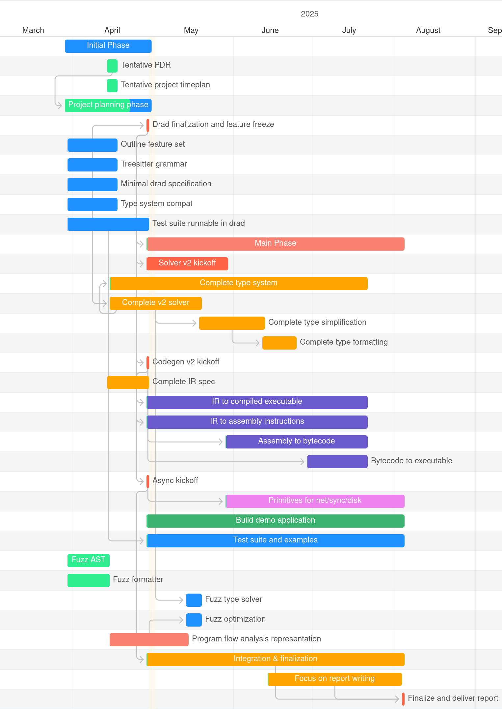

\newpage

## Project plan

In this document we present the overall project plan for the BRAD project, in appendix A the project plan is visualized
as a Gantt chart, followed by a structured overview of the tasks in appendix B. In appendix C a small risk matrix is
presented.

### Part 1: Dynamic compilation and optimization

Currently, the research language DRAD runs exclusively interpreted. This is significantly slower than other methods of
execution and as such is desirable to improve. To solve this issue, a compiler will be made with the goal of compiling
to machine code that is able to run natively on the computer’s CPU. As improving performance is the main goal,
development will be focused on x86_64 as it is what is available to test on. Testing will be done by benchmarking a
series of programs with the interpreter, and then as compiled programs to measure the improvement. Testing will also be
done against versions of the programs in already existing compiled languages to see how the compiler measures up against
real world examples, though this is not the goal of the project.

### Part 2: Type-system and inference

The DRAD language has a simple forward type system where all type parameters have to be specified at every option, eg.
function arguments and output, variables, generics in types and function invocation and more. Brad however allows all
type parameters to be optional, in which case the type system will infer the type. This requires replacing the simple
type system with another, better and more complex type system with type inference. A likely candidate for this is a
variation of a Hindley-Milner type system with open sum types, and potentially more. A series of test programs will be
written that the different type systems will be tested against, both in terms of correctness and in speed. Where the
number of types inferred in each test program is better.

### Part 3: Asynchronous runtime

To properly take advantage of concurrent systems (multiple cpus, multiple machines) we want to write applications that
take advantage of every possible way it can be made concurrently. This is in practice really difficult so we rely on
abstractions on multiple levels to attain concurrency. Lots of languages provide some way to interact with concurrency
either through low-level primitives (os-threads), higher level green threads and cooperative scheduling or super high
level “black box” concurrency.

These concurrency solutions are typically split down between traditional thread based concurrency and operating system
i/o concurrency. What this project intends to do is to take advantage of modern operating system primitives that can
integrate both traditional thread based concurrency and i/o concurrency into a single abstraction managed fully by the
language’s runtime. By extending our research language with a simple task api (`async` / `await`) and a standard library
with concurrency primitives we can integrate it with io_uring to achieve performant, efficient and concurrent
application execution with minimal load on the developer experience.

To evaluate the success of this approach we will compare a selection of programs that use conventional network and file
operations in DRAD then improve them with our new task api and compare runtime, throughput and memory efficiency.

\newpage

## Appendix A: Gantt chart

{
width=70%
height=70%
.inline
}

\newpage

## Appendix B: Task overview

| Activities                           | Start Date | End Date   | Type      | Task Owner |
|--------------------------------------|------------|------------|-----------|------------|
| Initial Phase                        | 29/03/2025 | 30/04/2025 | Main Task | Group      |
| Tentative PDR                        | 15/04/2025 | 18/04/2025 | Sub Task  | Javad      |
| Tentative project timeplan           | 15/04/2025 | 18/04/2025 | Sub Task  | Javad      |
| Project planning phase               | 29/03/2025 | 30/04/2025 | Sub Task  | Group      |
| Drad finalization and feature freeze | 30/04/2025 | 30/04/2025 | Milestone | Group      |
| Outline feature set                  | 31/03/2025 | 18/04/2025 | Sub Task  | Magnus     |
| Treesitter grammar                   | 31/03/2025 | 18/04/2025 | Sub Task  | Javad      |
| Minimal drad specification           | 31/03/2025 | 18/04/2025 | Sub Task  | Hjalte     |
| Type system compat                   | 31/03/2025 | 18/04/2025 | Sub Task  | Hjalte     |
| Test suite runnable in drad          | 31/03/2025 | 30/04/2025 | Sub Task  | Magnus     |
| Main Phase                           | 30/04/2025 | 05/08/2025 | Main Task | Group      |
| Solver v2 kickoff                    | 30/04/2025 | 30/05/2025 | Milestone | Hjalte     |
| Complete type system                 | 16/04/2025 | 22/07/2025 | Main Task | Hjalte     |
| Complete v2 solver                   | 16/04/2025 | 20/05/2025 | Sub Task  | Hjalte     |
| Complete type simplification         | 20/05/2025 | 13/06/2025 | Sub Task  | Hjalte     |
| Complete type formatting             | 13/06/2025 | 25/06/2025 | Sub Task  | Hjalte     |
| Codegen v2 kickoff                   | 30/04/2025 | 30/04/2025 | Milestone | Magnus     |
| Complete IR spec                     | 15/04/2025 | 30/04/2025 | Sub Task  | Magnus     |
| IR to compiled executable            | 30/04/2025 | 22/07/2025 | Main Task | Magnus     |
| IR to assembly instructions          | 30/04/2025 | 22/07/2025 | Sub Task  | Magnus     |
| Assembly to bytecode                 | 30/05/2025 | 22/07/2025 | Sub Task  | Magnus     |
| Bytecode to executable               | 30/06/2025 | 22/07/2025 | Sub Task  | Magnus     |
| Async kickoff                        | 30/04/2025 | 30/04/2025 | Milestone | Javad      |
| Primitives for net/sync/disk         | 30/05/2025 | 05/08/2025 | Main Task | Javad      |
| Build demo application               | 30/04/2025 | 05/08/2025 | Main Task | Hjalte     |
| Test suite and examples              | 30/04/2025 | 05/08/2025 | Main Task | Javad      |
| Fuzz AST                             | 31/03/2025 | 15/04/2025 | Sub Task  | Javad      |
| Fuzz formatter                       | 31/03/2025 | 15/04/2025 | Sub Task  | Javad      |
| Fuzz type solver                     | 15/05/2025 | 20/05/2025 | Sub Task  | Javad      |
| Fuzz optimization                    | 15/05/2025 | 20/05/2025 | Sub Task  | Javad      |
| Program flow analysis representation | 16/04/2025 | 15/05/2025 | Main Task | Hjalte     |
| Integration & finalization           | 30/04/2025 | 05/08/2025 | Main Task | Group      |
| Focus on report writing              | 15/06/2025 | 04/08/2025 | Sub Task  | Group      |
| Finalize and deliver report          | 05/08/2025 | 05/08/2025 | Milestone | Group      |

\newpage

## Appendix C: Risk Assessment

\begin{table}[H]
\centering
\begin{tabular}{|p{5cm}|c|c|p{6cm}|}
\hline
\textbf{Risk Description} & \textbf{Impact} & \textbf{Likelihood} & \textbf{Mitigations} \\
\hline
DRAD core not finalized by feature freeze & High & Medium & Prioritize essential features early. Freeze scope strictly
by 30/04/2025. \\
\hline
Compilation backend too complex to finish in time & High & Medium & Focus on basic IR-to-assembly pipeline first; delay
optimization if needed. \\
\hline
Type inference model too slow or error-prone & Medium & Medium & Benchmark early; fall back to a more constrained
inference model if needed. \\
\hline
io\_uring integration proves unstable/incompatible & Medium & Low & Abstract I/O layer; allow fallback to epoll or
native threading where necessary. \\
\hline
Integration of components delayed & High & Medium & Conduct early integration tests; use stubs/interfaces for parallel
development. \\
\hline
Gantt schedule underestimates testing/debug time & Medium & High & Reserve buffer weeks in July; reallocate non-critical
subtasks if needed. \\
\hline
\end{tabular}
\caption{Risk assessment focusing on critical project dependencies}
\end{table}
